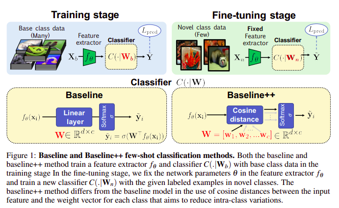

## Few-shot Image Classification <!-- omit in toc -->

## Table of contents <!-- omit in toc -->

- [**Few-shot classification**](#few-shot-classification)
	- [A closer look at Few-shot Classification](#a-closer-look-at-few-shot-classification)
	- [Dynamic Few-Shot Visual Learning without Forgetting](#dynamic-few-shot-visual-learning-without-forgetting)
- [**Few-shot Matching**](#few-shot-matching)
	- [LGM-Net: Learning to Generate Matching Networks for Few-shot Learning](#lgm-net-learning-to-generate-matching-networks-for-few-shot-learning)
- [**Resources**](#resources)

## **Few-shot classification**
### A closer look at Few-shot Classification
+ **Paper**: https://openreview.net/pdf?id=HkxLXnAcFQ  
	  
+ **Summary**:
    - Propose a **_Baseline_** classification method, by training a feature extractor _F_ and a classifier _C_ on base class data, then fine-tune _F_ and train a new _C_ in novel classes.
        - Improve the baseline into **_Baseline++_** by replacing linear layers of feature extraction by _Cosine Distance_
        - Thus, **_adapting a distance-based method_** instead of linear classifier helps _boost model performance_ (competitive to current SOTA)
    - Provide unified testbed for few-shot learning classification algorithms for fair evaluation. The evaluation shows that:
        - _Deeper backbones_ significantly **_reduce the performance gap between FS methods_** when domain differences (between base & novel classes) are limited
		- **_Reducing intra-class variation_** is an _important_ factor when _the feature backbone shallow_, but _not as critical_ when using _deep backbone_
    - Investigate a pactical evaluation setting where base & novel classes are samples from different domain
		- Current FS classification algorithms _fail to address domain shifts_
		- As domain differences are likely to exist in real-world application and grows larger, **_learning to learn adaptation_** in meta-training stage is an important future direction
+ **Code**: https://github.com/wyharveychen/CloserLookFewShot

### Dynamic Few-Shot Visual Learning without Forgetting
+ **Paper**: https://arxiv.org/pdf/1804.09458.pdf  
	  
+ **Summary**:
	+ Develope a visual learning system that can _learn novel classes_ but still able to recognize _both_ novel & base classes
	+ Consist of 2 main parts:
    	- **_Few-shot classification weight generator_** => dynamically generate class weight _W_novel_ for novel classes with few-shot setting (<= 5 Shot)
    	- **_ConvNet-based recognition model_** (including a _Feature extractor_ and a _Classifier_) => recognize both base and novel classes (by combining _W_base_ and _W_novel_)
    + Improve _ConvNet-based classifier_ with **_cosine similarity function_** => better feature representation, better unified feature representation between base and novel classes.
    + Improve _FS Weight generator_ with an **_attention mechanism_** => explicitly exploits the acquired past knowledge from base classes => significant boost on the novel class performance (especially on one-shot)
	+ Evaluated on Mini-ImageNet, achieved _56.20% Acc_ on 5-way 1-shot and _73.00% Acc_ on 5-way 5-shot setting
+ **Code**: https://github.com/gidariss/FewShotWithoutForgetting

## **Few-shot Matching**
### LGM-Net: Learning to Generate Matching Networks for Few-shot Learning
 + **Paper**: http://proceedings.mlr.press/v97/li19c/li19c.pdf  
	  
 + **Summary**:
    - Propose a meta-learning apporach for Few-shot classification called **_LGM-Net_**, including 2 key modules:
        - **_TargetNet_** (base-level learner): 
			- Adapt _matching network_ as main architecture, received functional weight from MetaNet => make prediction on specific novel tasks
        - **_MetaNet_** (meta-level learner):
          - Generate functional weights for TargerNet
          - Containing a _task context encoder_ to learn task context representation and _weight generator_ to learn the conditional distribution of functional weight
    - Experimental with 5-way 1-shot setting, achieved _99.0% Acc_ on Omniglot and _69.15±0.35% Acc_ on miniImageNet.
+ **Code**: https://github.com/likesiwell/LGM-Net/

## **Resources**
+ https://github.com/Duan-JM/awesome-papers-fewshot/blob/master/cv/image_classification/README.md (**paper**, **code**, **recap**)

  
  
These notes were created by [quanghuy0497](https://quanghuy0497.github.io/)@2022