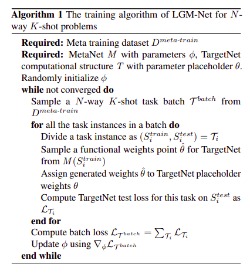
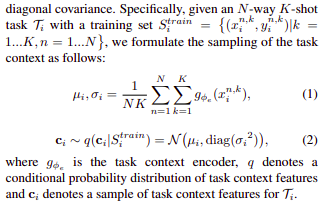

## Few-shot Image Classification

## Table of contents
* [**Few-shot Classification**](#Few-shot-classification)
	* [A closer look at Few-shot Classification](#A-closer-look-at-Few-shot-Classification)
* [**Few-shot Matching**](#Few-shot-matching)
	* [LGM-Net: Learning to Generate Matching Networks for Few-shot Learning](#LGM-Net-Learning-to-Generate-Matching-Networks-for-Few-shot-Learning)
* [**Resources**](#Resources)

## Few-shot classification
### A closer look at Few-shot Classification
+ **Paper**: https://openreview.net/pdf?id=HkxLXnAcFQ
+ **Few-shot classification**:
	- Few-shot classification aims to learn a classifier to recognize unseen novel classes with limited labeled data **_Xn_** (support set) given abundant training labeled **_Xb_**.
	- However, the growing complexity of network designs, meta-learning algorithms, differences in implementation details make a fair comparision difficults.
	+ **Baseline model**:  
		  
		+ **_Training state with base data_**: With **_xi ∈ Xb_**, train a feature extractor **_fθ_**  and a classifier **_C(.|Wb)_ = σ[Wb^T.fθ(xi)]** (a linear layer followed by a softmax function) from _scratch_ by minimizing a standard cross-entroypy losss **_L_pred_**. 
			+ **BaseLine++**: Instead of using _linear layer_, the Baseline++ adapt _cosine distance_ to reduce intra-class variations. With **_Wb_** can be rewrite as vectors [w1, w2,...,wc], for an input feature **_fθ(xi)_; _xi ∈ Xb_**, the similarity scores _[s1, s2,...,sc]_ is calculate by computer cosine distance between _fθ(xi)_ and _[s1...sc]_ for all classes. Then, softmax is applied to normalize **_s_** to obtain prediction probalities. Intuitively, the learned vectors [w1,..,wc] can be interpret at prototypes.
		+ **_Fine-tuning stage with novel data_**: fix the pre-trained network parameter _θ_ in **_fθ_** and train a new classifier **_C(.|Wn)_** by minimizing **_L_pred_** using **_Xn_**.
+ **Meta-Learning algorithms**:
	  
	+ A few-shot learning as meta-learning if the prediction is conditioned on a small support set **_S_**, because it makes the training procedure explicitly _learn to learn_ from a given **_S_** [Vinyals et al (2016)](https://arxiv.org/pdf/1606.04080.pdf).
	+ Meta-learning algorithms consist of a meta-training and meta-testing stage.
+ **Experimental setting & results**:
	- Please read the paper to capture the setup and achieved results.
+ **Contribution**:
	- Deeper backbones significantly reduce the performance differences among methods on datasets with limited domain differences (between base and novel class).
	- Reducing intra-class variation is an important factor in the current few-shot classification problem setting
	- As the domain difference grows larger, the adaptation based on a few novel class instances becomes more important.
+ **Code**: https://github.com/wyharveychen/CloserLookFewShot

## Few-shot Matching
### LGM-Net: Learning to Generate Matching Networks for Few-shot Learning
 + **Paper**: http://proceedings.mlr.press/v97/li19c/li19c.pdf  
 + **Problem formulation**:
	- 3 Datasets includes Meta training dataset _D_meta-train_ for training model; Meta validation dataset _D_meta-val_ for model selection; Meta test set _D_meta-test_ for evaluating model generalization on unseen tasks. Each dataset contains a disjoint set of target classes.
	- For each dataset, the author can construct a task distribution _p(T)_ of N-way K-shot tasks. Each task instance _Ti_ ~ _p(T)_ consists of training set _Si_train_ and a test set _Si_test_.
	- _Si_train_ contains _N_ classes randomly selected from the meta dataset and _K_ samples for each class. _Si_test_ contains unseen samples for classes in _Si_train_ and provides an estimation of generation performance on the _N_ classes for task _Ti_.
+ **Methodology**:  
	  
	- Firstly, a batch of task **_T_batch_** is selected from the meta training dataset.
	- For each task instance **_Ti_**, the **_MetaNet_** module generates a functional weight point **_θ^ = M(Si_train)_** for the TargetNet conditioned on the training set
	- Then, the **_TargetNet_** assigned with generated weights can infer the matching probability scores for test samples. The classification loss is simultaneously computed.
	- Finally, for each task in a batch, the losses are accumulated and the gradient updates are computed for the parameter in MetaNet.
	- For high dimensional input data, a learnable embedding module _fϕ_ is used to extract low dimensional features at inputs for the two modules => the amount of parameters of the entire model can be reduced.
+ **LGM-Net**:  
	  
	- Learns transferable prior knowledge across tasks and directly produces network parameters for similar unseen tasks with training samples for few-shot classification
	- Including two key modules:
		- **_MetaNet_** (meta-level learner): aims at learning to generate functional weights for TargetNet by observing training samples. Including:
			- **_Task context encoder_**:
				- Aims to encode all the training samples of a task and generate a feature representation of the task with a fixed size. 
				- Are reparameterized as a _conditional multivariate Gaussian distribution_ with diagonal covariance.
				- Specifically, the sampling of the task context can be formulated by:  
					
			- **_Conditional Weight generator_**: 
				- Learns the conditional distribution of the functional weight of TargetNet. Trained to generate the functional weights for TargetNet for each task context features on encoded task representation. 
				- For each layer of the TargetNet, a _conditional single layer perception_ is constructed as the generator to produce weight.
				- _Weight normalization (WN)_ is applied to constrain the weight scale for facilitating the training process, but learnable parameters are removed
				- For the generated weights of _a conv layer_, the _L2 norm_ is applied to _each kernel_ rather than the entire conv weight
				- For the generated weights of a _FC layers_, _the L2 norm_ is applied to _each hyperplane weights_, which can be formulated as:  
					
		- **_TargetNet_** (based-level learner): a neural network for solving specific task
			- Using _matching network_ as the architecture
			- The functional weights of TargetNet are generated by MetaNet based on training samples.
			- As there are many new designed parametric layers in neural networks (i.e. parametric ReLU, batch norm) that contain learnable parameters and aim to stabilize the training of DNNs, the authors only consider generating conv kernels, bias, and FC weights. 
			- Detail of TargetNet fomular:  
				  
			- Finally, the cross-entropy loss is adopted to construct the final objective function between the predicted probability and the ground truth.
	- **_Intertask Normalization_**:
		- The authors propose an intertask normalization (ITN) strategy to make the tasks interact with each other in a batch of tasks.
		- In practice, batch norm is applied directly on the embedding module and task context encoder. The norm is applied to all training samples of a task batch, rather than just to samples of each individual task.
		- During a testing phase, the trained model is independently applied on each individual unseen task.
+ **Code**: https://github.com/likesiwell/LGM-Net/

## Resources
+ https://github.com/Duan-JM/awesome-papers-fewshot/blob/master/cv/image_classification/README.md (**paper**, **code**, **recap**)

  
  
These notes were created by [quanghuy0497](https://quanghuy0497.github.io/)@2022