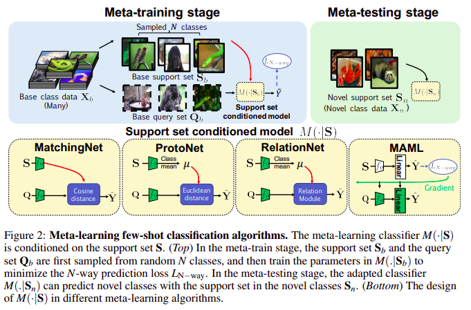
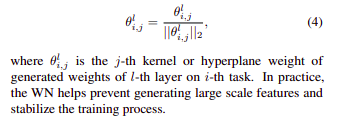
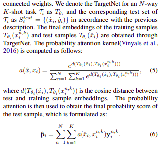

## Few-shot Image Classification <!-- omit in toc -->

## Table of contents <!-- omit in toc -->

- [**Few-shot classification**](#few-shot-classification)
	- [A closer look at Few-shot Classification](#a-closer-look-at-few-shot-classification)
	- [Dynamic Few-Shot Visual Learning without Forgetting](#dynamic-few-shot-visual-learning-without-forgetting)
- [**Few-shot Matching**](#few-shot-matching)
	- [LGM-Net: Learning to Generate Matching Networks for Few-shot Learning](#lgm-net-learning-to-generate-matching-networks-for-few-shot-learning)
- [**Resources**](#resources)

## **Few-shot classification**
### A closer look at Few-shot Classification
+ **Paper**: https://openreview.net/pdf?id=HkxLXnAcFQ
+ **Summary (TL;DR)**:
    - Propose a **_Baseline_** classification method, by training a feature extractor _F_ and a classifier _C_ on base class data, then fine-tune _F_ and train a new _C_ in novel classes.
        - Improve the baseline into **_Baseline++_** by replacing linear layers of feature extraction by _Cosine Distance_
        - Thus, **_adapting a distance-based method_** instead of linear classifier helps _boost model performance_ (competitive to current SOTA)
    - Provide unified testbed for few-shot learning classification algorithms for fair evaluation. The evaluation shows that:
        - _Deeper backbones_ significantly **_reduce the performance gap between FS methods_** when domain differences (between base & novel classes) are limited
		- **_Reducing intra-class variation_** is an _important_ factor when _the feature backbone shallow_, but _not as critical_ when using _deep backbone_
    - Investigate a pactical evaluation setting where base & novel classes are samples from different domain
		- Current FS classification algorithms _fail to address domain shifts_
		- As domain differences are likely to exist in real-world application and grows larger, **_learning to learn adaptation_** in meta-training stage is an important future direction
+ **Few-shot classification**:
	- Few-shot classification aims to learn a classifier to recognize unseen novel classes with limited labeled data **_Xn_** (support set) given abundant training labeled **_Xb_**.
	- However, the growing complexity of network designs, meta-learning algorithms, differences in implementation details make a fair comparision difficults.
	+ **Baseline model**:  
		  
		+ **_Training state with base data_**: With **_xi ∈ Xb_**, train a feature extractor **_fθ_**  and a classifier **_C(.|Wb)_ = σ[Wb^T.fθ(xi)]** (a linear layer followed by a softmax function) from _scratch_ by minimizing a standard cross-entroypy losss **_L_pred_**. 
			+ **BaseLine++**: Instead of using _linear layer_, the Baseline++ adapt _cosine distance_ to reduce intra-class variations. With **_Wb_** can be rewrite as vectors [w1, w2,...,wc], for an input feature **_fθ(xi)_; _xi ∈ Xb_**, the similarity scores _[s1, s2,...,sc]_ is calculate by computer cosine distance between _fθ(xi)_ and _[s1...sc]_ for all classes. Then, _softmax_ is applied to _normalize_ **_s_** to obtain prediction probalities. Intuitively, the learned vectors [w1,..,wc] can be interpret at prototypes.
		+ **_Fine-tuning stage with novel data_**: fix the pre-trained network parameter _θ_ in **_fθ_** and train a new classifier **_C(.|Wn)_** by minimizing **_L_pred_** using **_Xn_**.
+ **Meta-Learning algorithms**:
	  
	+ A few-shot learning as meta-learning if the prediction is conditioned on a small support set **_S_**, because it makes the training procedure explicitly _learn to learn_ from a given **_S_** [[Vinyals et al (2016)]](https://arxiv.org/pdf/1606.04080.pdf).
	+ Meta-learning algorithms consist of a meta-training and meta-testing stage.
+ **Experimental setting & results**:
	- Please read the paper to capture the setup and achieved results.
+ **Code**: https://github.com/wyharveychen/CloserLookFewShot

### Dynamic Few-Shot Visual Learning without Forgetting
+ **Paper**: https://arxiv.org/pdf/1804.09458.pdf
+ **Summary (TL;DR)**:
	+ Develope a visual learning system that can _learn novel classes_ but still able to recognize _both_ novel & base classes
	+ Consist of 2 main parts:
    	+ **_Few-shot classification weight generator (G)_** => dynamically generate class weight _W_novel_ for novel classes with few-shot setting (<= 5 Shot)
        	- Improve by a **_cosine similarity function_** => better feature representation, better unified feature representation between base and novel classes.
    	+ **_ConvNet-based recognition model_** (including a _feature extractor **F**_ and a _classifier **C**_) => recognize both base and novel classes (by combining _W_base_ and _W_novel_)
            - Improve by an **_attention mechanism_** => explicitly exploits the acquired past knowledge from base classes => significant boost on the novel class performance (especially on one-shot)
    + Including 2 training stages:
        + **_First stage_**: Training **_F_** and **_C_** on _base data_
        + **_Second stage_**: Using a small random classes from base data as _"fake novel classes"_ data to train **_G_**, then fine-tune **_C_** with weights from "fake novel" and _"remain base classes"_ data => can recognize both base and novel classes.
          + Replace _"fake novel"_ by _"actual novel"_ data in testing
	+ Evaluated on Mini-ImageNet, achieved _56.20% Acc_ on 5-way 1-shot and _73.00% Acc_ on 5-way 5-shot setting
+ **Approach**:
	  
	1. **_ConvNet-based recognition model_**:
    	- The ConvNet is consists of two modules, including:
        	-  A feacture extractor `Z = F(X_base|θ)` with learnable paprameter _θ_ from input image _X_base_
        	- A Classifier `P = C(Z|W*)` where _W*_ are a set of _N*_ weight vectors that output a _N*-dimensional_ vector with the probability scores of these _N*_ classes.
      	- During the training phase, _θ_ can be learned to help ConvNet recognize the _base classes_ by setting `W* = W_base` (thus learn the class weight _W_base_ by doing so). During the test phase, ConvNet can recognize both the _base and novel classes_ by setting `W* = W_base U W_novel`
      	- **_Improvement: ConvNet with Cosine Similarity:_**
        	- **_Standard setting_** (standard):
            	- The classifier is calculated by `P = C(Z|W*) = Softmax(Z^T.W*)` with _dot product operation_.
            	- However, the completely different between _W_based_ and _W_novel_ leads to totally different magnitudes with dot product operation. Therefore impede the training process severely and prevent having a unified recognition of both 2 types of classes.
        	- **_Improve setting_** (proposed): 
            	- Replace dot product by _cosine similarity_:
                	- `P = C(Z|W*) = Softmax(S)` with `S = r.cos(Z, W*) = r.||Z||^T.||W*||` 
                    	- Where _||Z||_ and _||W*||_ are the L2_norm of _Z_ and _W*_, and _r_ is the scalar to control the peakiness of the prob distribution (In the experiment, r = 10)
            	- Remove _ReLU of the last hidden layer_ of feature extractor _F(.|θ)_ => allow _Z_ to take bot positive & negative value (similar to the weight vectors _W*_)
            - **_Cosine similarity_** not only helps _making possible the unified recognition_ of both base and novel class but also leads the feature extractor to _learn features that generalize significantly better on novel class_ than with the dot-product based setting => surpass prior SOTA approaches in image matching **_(novelty)_**
	2. **_Few-shot classification Weight Generator_**:
    	-  Dynamically generates classification weight vector for novel classes during test time using a meta-learning mechanism.
    	-  For each novel class _n ∈ N_novel_, the weight generator _G_ takes two inputs:
            1.  _Feature vector_ `Z' = F(X_novel|θ)`. Note that _X_novel_ follow the N-way K-shot setting. 
                -  In the paper, X_novel is denoted as `{X'_n,i} with i ∈ [1, K'n]` where _K'n_ is the number of support examples _(K-shot)_ of _n_-th novel category _(N way)_
          	1.  _The based classification weight vector_ `W_base`
    	- Then, the novel classification weight vector _W_novel_ is generated by `W_novel = G(Z', W_base|φ)` with _φ_ is the learned parameter of the few-shot weight generator _G_. 
    	-  Therefore, if _W_novel_ are the _novel classification weight vector_ inferred by _G_, then by setting `W* = W_base U W_novel` on the classifier `C(Z, Z'|W*)`, the ConvNet model is able to recognize both base and novel classes.   
    	-  **_Improvement: Attention-based weight generator_**:
            -  **_Feature averaging based_** (standard):
               - With Cosine similarity applied for the ConvNet model, a convention method to calculate the _W_novel_ is:
                    - `W_novel = φ_avg <.> W'avg` with `W'avg = mean(||Z'||)`.
                      - Where `<.>` is the _Hadamard product_ with _φ_avg_ is the learnable weight vector. _K'_ is the number of support examples (K' <=5 typically).
                - However, this method does not fully exploit the knowledge about the visual world that ConvNet acquires during its training phase.
            - **_Attention-based_** (proposed):
				- This feature averaging mechanism above can be enhanced by adding an _attention based mechanism_ that composes novel classification weight vector _ W'att_, computed by:
    				- `W'att = mean[Attn(φ_q.||Z'||, k_b).||W_base||]`
        				- Where _φ_q_ is a learnable weight matrix that transforms _||Z'||_ to query vector used for querying the memory, _{k_b}_ is a set of _K_base_ learnable key (one per base class) used for indexing. And _Att()_ is an attention kernel implemented as a _cosine similarity func_ _followed by softmax_ 
    				- Then, `W_novel = φ_avg <.> W'avg + φ_att <.> W'att` (_φ_avg_ and _φ_att_ are learnable weight vector)
  				-  By using _cosine similarity_, the base weight vector _W_base_ can also encode visual similarity (along with learning class representation feature vectors). Therefore, the novel weight vector _W_novel_ can be composed as a linear combination with _w_base ∈ W_base_ that are most similar => Attention mechanism allows Few-shot Weight generator to explicitly exploit the prior acquired knowledge (represented by _W_base_) to improve the few-shot recognition performance.  **_(novelty)_**
                    -  This improvement is very significant, especially in the _one-shot setting_ (where averaging cannot provide an accurate weight vector)
+ **Training procedure**:
	- For training ConvNet recognition model (including feature extractor _F(.|θ)_ and the classifier _C(.|W*)_) and the Few-shot classification Weight generator _G(.,.|φ)_, the training set _D_train_ on _N_base_ classes is used as the sole input.
	- The training procedure is split into 2 stages (and minimizing two cross-entropy losses for each):
    	- _1st training stage_: only learn _θ_ for _F(.|θ)_ and _W* = W_base_ for _C(.|W*)_ without involving _G_ 
    	- _2nd training stage_: train _φ_ for _G(.,.|φ)_ while keep training _C_ (but _F_ is frozen).
        	- For training _G_, in each batch, _N "fake novel" classes_ are picked randomly _from the base classes_, then K-shot samples are selected for each "fake novel" classes to compute _Z'_, thus `W_fakenovel = G(Z', W_base|φ)`. Note that the "fake novel" classes weight vectors are removed from _W_base_ (let's call it _W_baseremain_), thus compute `W* = W_fakenovel U W_baseremain` for training _C_
        	- In testing, replace "fake novel" classes by "actual novel" classes.
+ **Code**: https://github.com/gidariss/FewShotWithoutForgetting

## **Few-shot Matching**
### LGM-Net: Learning to Generate Matching Networks for Few-shot Learning
 + **Paper**: http://proceedings.mlr.press/v97/li19c/li19c.pdf  
 + **Summary (TL;DR)**:
    - Propose a meta-learning apporach for Few-shot classification called **_LGM-Net_**, including 2 key modules:
        - **_TargetNet_** (base-level learner): 
			- Adapt _matching network_ as main architecture, received functional weight from MetaNet => make prediction on specific novel tasks
        - **_MetaNet_** (meta-level learner):
          - Generate functional weights for TargerNet
          - Containing a _task context encoder_ to learn task context representation and _weight generator_ to learn the conditional distribution of functional weight
    - Experimental with 5-way 1-shot setting, achieved _99.0% Acc_ on Omniglot and _69.15±0.35% Acc_ on miniImageNet.
 + **Problem formulation**:
	- 3 Datasets includes Meta training dataset _D_meta-train_ for training model; Meta validation dataset _D_meta-val_ for model selection; Meta test set _D_meta-test_ for evaluating model generalization on unseen tasks. Each dataset contains a disjoint set of target classes.
	- For each dataset, the author can construct a task distribution _p(T)_ of N-way K-shot tasks. Each task instance _Ti_ ~ _p(T)_ consists of training set _Si_train_ and a test set _Si_test_.
	- _Si_train_ contains _N_ classes randomly selected from the meta dataset and _K_ samples for each class. _Si_test_ contains unseen samples for classes in _Si_train_ and provides an estimation of generation performance on the _N_ classes for task _Ti_.
+ **Methodology**:  
	  
	- Firstly, a batch of task **_T_batch_** is selected from the meta training dataset.
	- For each task instance **_Ti_**, the **_MetaNet_** module generates a functional weight point **_θ^ = M(Si_train)_** for the TargetNet conditioned on the training set
	- Then, the **_TargetNet_** assigned with generated weights can infer the matching probability scores for test samples. The classification loss is simultaneously computed.
	- Finally, for each task in a batch, the losses are accumulated and the gradient updates are computed for the parameter in MetaNet.
	- For high dimensional input data, a learnable embedding module _fϕ_ is used to extract low dimensional features at inputs for the two modules => the amount of parameters of the entire model can be reduced.
+ **LGM-Net**:  
	  
	- Learns transferable prior knowledge across tasks and directly produces network parameters for similar unseen tasks with training samples for few-shot classification
	- Including two key modules:
		- **_MetaNet_** (meta-level learner): aims at learning to generate functional weights for TargetNet by observing training samples. Including:
			- **_Task context encoder_**:
				- Aims to encode all the training samples of a task and generate a feature representation of the task with a fixed size. 
				- Are reparameterized as a _conditional multivariate Gaussian distribution_ with diagonal covariance.
				- Specifically, the sampling of the task context can be formulated by:  
					
			- **_Conditional Weight generator_**: 
				- Learns the conditional distribution of the functional weight of TargetNet. Trained to generate the functional weights for TargetNet for each task context features on encoded task representation. 
				- For each layer of the TargetNet, a _conditional single layer perception_ is constructed as the generator to produce weight.
				- _Weight normalization (WN)_ is applied to constrain the weight scale for facilitating the training process, but learnable parameters are removed
				- For the generated weights of _a conv layer_, the _L2 norm_ is applied to _each kernel_ rather than the entire conv weight
				- For the generated weights of a _FC layers_, _the L2 norm_ is applied to _each hyperplane weights_, which can be formulated as:  
					
		- **_TargetNet_** (based-level learner): a neural network for solving specific task
			- Using _matching network_ as the architecture
			- The functional weights of TargetNet are generated by MetaNet based on training samples.
			- As there are many new designed parametric layers in neural networks (i.e. parametric ReLU, batch norm) that contain learnable parameters and aim to stabilize the training of DNNs, the authors only consider generating conv kernels, bias, and FC weights. 
			- Detail of TargetNet fomular:  
				  
			- Finally, the cross-entropy loss is adopted to construct the final objective function between the predicted probability and the ground truth.
	- **_Intertask Normalization_**:
		- The authors propose an intertask normalization (ITN) strategy to make the tasks interact with each other in a batch of tasks.
		- In practice, batch norm is applied directly on the embedding module and task context encoder. The norm is applied to all training samples of a task batch, rather than just to samples of each individual task.
		- During a testing phase, the trained model is independently applied on each individual unseen task.
+ **Code**: https://github.com/likesiwell/LGM-Net/

## **Resources**
+ https://github.com/Duan-JM/awesome-papers-fewshot/blob/master/cv/image_classification/README.md (**paper**, **code**, **recap**)

  
  
These notes were created by [quanghuy0497](https://quanghuy0497.github.io/)@2022